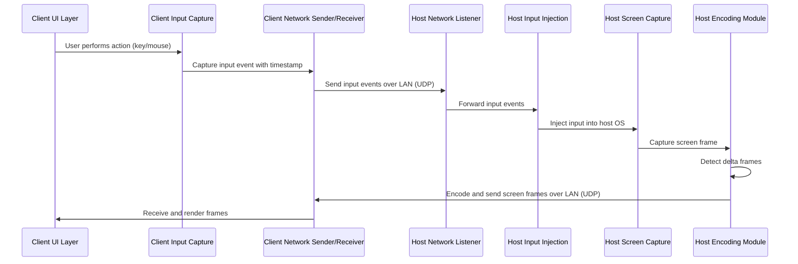

# LANRemoteControl Architecture Overview

## Project Description
LANRemoteControl is a pure LAN PC remote control software designed for extremely low latency, lossless image quality, and a minimalist user interface. It operates exclusively on local area networks (LAN) without relying on public internet infrastructure.

## System Components

### 1. Host Service (`src-host/`)
The host service runs on the computer being controlled and is responsible for:
- **Network Listener**: Listens for incoming connection requests and control commands via UDP/TCP protocols optimized for LAN.
- **Screen Capture Module**: Captures screen content using OS-specific APIs (e.g., DXGI for Windows, X11/Wayland for Linux, Quartz Display Copying Service for macOS).
- **Encoding Module**: Processes captured screen frames using delta frame detection and applies lossless or ultra-low-latency compression (e.g., LZ4 for raw delta frames or low-delay H.264 profiles).
- **Input Injection Module**: Receives keyboard and mouse events from the client and injects them into the host OS using low-level APIs (e.g., `SendInput` for Windows).

### 2. Client Application (`src-client/`)
The client application runs on the controlling computer and is responsible for:
- **UI Layer**: Provides a minimalist connection panel (IP input, Connect button, status indicator) and a clean remote control window (frame display area, fullscreen toggle, disconnect button).
- **Network Sender/Receiver**: Establishes and maintains UDP/TCP connections to the host service, sending input events and receiving screen frames.
- **Decoding & Rendering Module**: Decodes incoming screen frames and renders them to the UI with minimal latency.
- **Input Capture Module**: Captures local keyboard and mouse events on the client side and forwards them to the host.

## Data Flow Diagram

## Key Design Principles

1. **Pure LAN Operation**: No public internet dependency; all communication occurs within the local network using local IP addresses and configurable ports.
2. **Extremely Low Latency**: Utilizes UDP for data transmission with custom sequence/ACK mechanisms, TOS/QoS settings for low delay, and minimal processing overhead in screen capture and encoding.
3. **Lossless Image Quality**: Employs delta frame detection to only transmit changed regions of the screen, using lossless compression algorithms (e.g., LZ4) or ultra-low-latency video encoding profiles.
4. **Minimalist UI**: Focuses on essential functionality with a clean, uncluttered interface that minimizes distractions and maximizes the remote control area.
